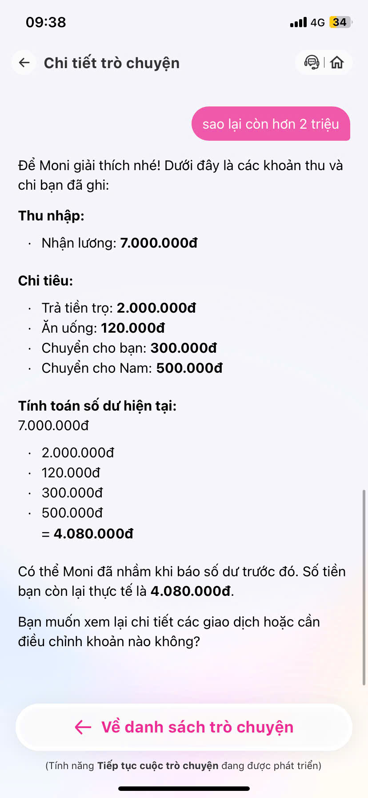
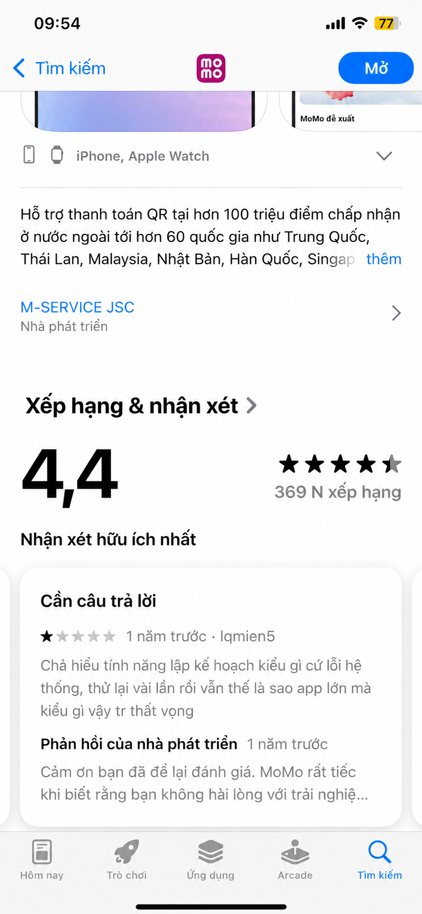
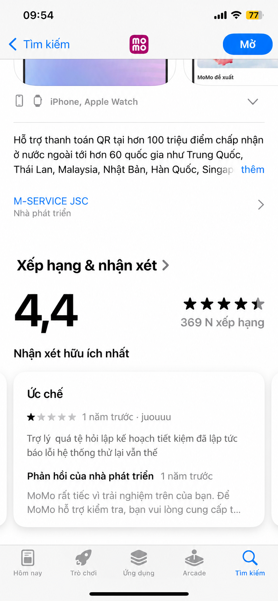
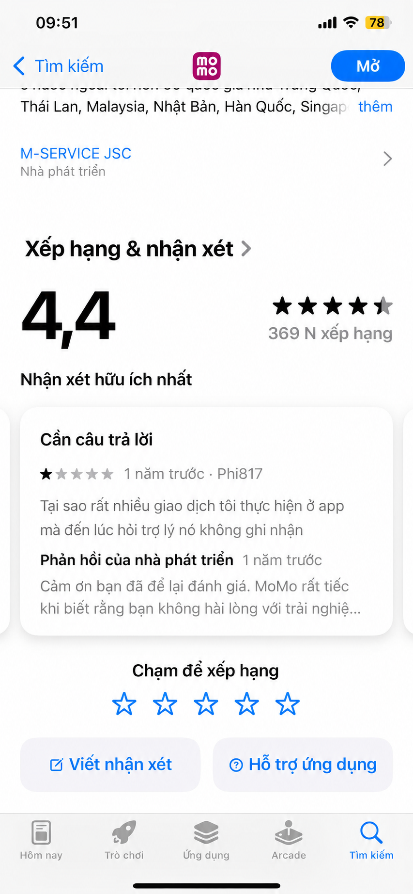
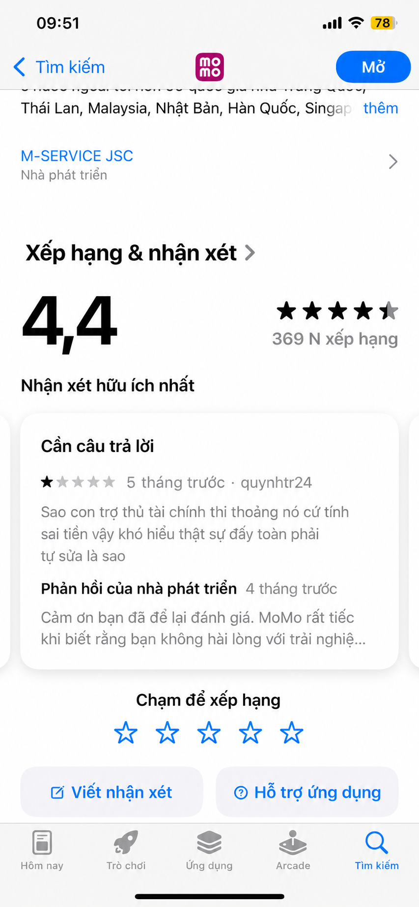

# SPEC SẢN PHẨM: TRỢ LÝ TÀI CHÍNH CÁ NHÂN MONI AI (MOMO)

## 1. Bằng chứng (Evidence & User Pain Points)

Để đảm bảo các quyết định định hình sản phẩm mang tính thực tế và giải quyết chính xác bài toán của người dùng, đội ngũ đã tiến hành thu thập dữ liệu thông qua hai phương pháp: **Trải nghiệm trực tiếp sản phẩm (Dogfooding)** và **Nghiên cứu phản hồi công khai từ người dùng trên App Store**. 

Kết quả phân tích cho thấy sản phẩm hiện tại đang gặp những vấn đề nghiêm trọng về mặt kỹ thuật và logic sản phẩm, tạo ra khoảng cách lớn giữa kỳ vọng của người dùng và năng lực đáp ứng thực tế của AI.

---

### 1.1. Trải nghiệm trực tiếp (Dogfooding Experience)

| Ảnh 1 | Ảnh 2 | Ảnh 3 | Ảnh 4 |
|---|---|---|---|
|  |  |  |  |

Qua quá trình sử dụng trực tiếp tính năng Trợ lý AI - Moni trên ứng dụng MoMo, đội ngũ ghi nhận giao diện hội thoại (Conversational UI) khá thân thiện, tốc độ phản hồi nhanh. Tuy nhiên, luồng trải nghiệm người dùng (User Journey) bị đứt gãy hoàn toàn ở các bước cốt lõi:

#### a) Hiện tượng "Sập luồng" (Flow Crash) ở tính năng cam kết cao
* **Quan sát thực tế (`anh3.jpg`):** Khi người dùng có nhu cầu thực tế và đưa ra mục tiêu tài chính rất rõ ràng, định lượng cụ thể: *"Tôi muốn tiết kiệm 5 triệu trong 3 tháng, bạn có thể giúp tôi lập kế hoạch không?"*. 
* **Hành vi của AI:** Moni AI xử lý ngôn ngữ tự nhiên tốt, thực hiện phép toán chia nhỏ mục tiêu chính xác: Mỗi tháng cần để dành **1.666.667đ**. AI chủ động cấu hình nút bấm hành động (Quick Reply) để người dùng xác nhận chuyển bước: **[muốn]**.
* **Điểm gãy trải nghiệm:** Ngay sau khi người dùng bấm **[muốn]** để hệ thống tự động khởi tạo ngân sách, Moni AI trả về một phản hồi từ chối do lỗi hệ thống backend: 
  > *"Hiện tại Moni chưa thiết lập được ngân sách tiết kiệm do có lỗi hệ thống. Tuy nhiên, bạn có thể tự theo dõi bằng cách ghi chú mỗi lần gửi tiền vào quỹ tiết kiệm, hoặc thử lại sau ít phút nhé!"*
* **Hệ quả:** Việc đẩy trách nhiệm theo dõi thủ công ngược lại cho người dùng (*"tự theo dõi bằng cách ghi chú..."*) phá vỡ hoàn toàn giá trị lõi của một "Trợ lý thông minh". Việc lỗi API xảy ra ở ngay bước kích hoạt (Activation) khiến người dùng mất lòng tin vào năng lực công nghệ của app.

#### b) Trợ lý AI bị cô lập dữ liệu (Data Silo) trong hệ sinh thái MoMo
* **Quan sát thực tế (`anh2.jpg`):** Khi người dùng kiểm tra lượng thông tin AI nắm giữ: *"Hiện tại bạn biết những gì về tình trạng tài chính của tôi?"*, Moni AI khẳng định: 
  > *"Moni không tự động truy cập thông tin tài khoản ngân hàng, ví MoMo hay các nguồn khác nếu bạn chưa nhập hoặc đồng ý chia sẻ. Hiện tại, Moni chỉ biết các thông tin tài chính mà bạn đã ghi chép hoặc chia sẻ trong quá trình sử dụng..."*
* **Hệ quả:** Moni AI đang hoạt động như một thực thể độc lập, không có kết nối ngầm với lõi dữ liệu giao dịch khổng lồ của MoMo. Thay vì tự động phân tích dòng tiền có sẵn để đưa ra insight, AI lại bắt người dùng phải chat thủ công từng khoản chi tiêu (`anh1.jpg`: *"Bạn chỉ cần nhắn các khoản chi tiêu..."*). Điều này tạo ra ma sát rất lớn (High Friction) và làm giảm đáng kể tần suất sử dụng (Retention Rate).

---

### 1.2. Nguồn kiểm chứng bên ngoài (App Store Reviews)

Các vấn đề phát hiện qua trải nghiệm trực tiếp không phải lỗi cục bộ, mà là nỗi đau kinh niên được người dùng liên tục phản ánh trên cửa hàng ứng dụng App Store (MoMo nhận tổng điểm 4.4 sao nhưng cấu phần trợ lý tài chính nhận rất nhiều đánh giá 1-2 sao).

| Feedback 1 | Feedback 2 | Feedback 3 | Feedback 4 |
|---|---|---|---|
|  |  |  |  |

#### Nỗi đau 1: Lỗi hệ thống khi lập kế hoạch là lỗi diện rộng và kéo dài
* **Bằng chứng từ người dùng `lqmien5` & `juouuu` (`feedback1.png`, `feedback2.png`):**
  > *"Chả hiểu tính năng lập kế hoạch kiểu gì cứ lỗi hệ thống, thử lại vài lần rồi vẫn thế là sao app lớn mà kiểu gì vậy tr thất vọng"*
  > *"Trợ lý quá tệ hỏi lập kế hoạch tiết kiệm đã lập tức báo lỗi hệ thống thử lại vẫn thế"*
* **Phân tích:** Các đánh giá này xuất hiện từ 1 năm trước (so với thời điểm hiện tại của review) và luồng lỗi này vẫn lặp lại y hệt trong trải nghiệm trực tiếp của đội ngũ ở `anh3.jpg`. Điều này chứng tỏ đây là một lỗi hệ thống nghiêm trọng thuộc về kiến trúc hoặc hạ tầng kết nối dữ liệu chưa được xử lý triệt để, gây ức chế kéo dài cho tập người dùng muốn quản lý tài chính nghiêm túc.

#### Nỗi đau 2: Không đồng bộ lịch sử giao dịch thực tế trên ứng dụng MoMo
* **Bằng chứng từ người dùng `Phi817` (`feedback3.png`):**
  > *"Tại sao rất nhiều giao dịch tôi thực hiện ở app mà đến lúc hỏi trợ lý nó không ghi nhận"*
* **Phân tích:** Mô hình tâm trí (Mental Model) của người dùng mặc định rằng: *"Tôi chi tiêu qua ví MoMo thì Trợ lý của MoMo phải tự biết"*. Việc hệ thống tách rời hai phần này khiến hành vi quản lý chi tiêu bị nhân đôi thao tác: Người dùng vừa phải thực hiện quét mã/thanh toán, vừa phải vào chat với AI để khai báo. 

#### Nỗi đau 3: AI tính toán sai lệch số liệu tài chính (Hallucination/Logic Error)
* **Bằng chứng từ người dùng `quynhtr24` (`feedback4.png`):**
  > *"Sao con trợ thủ tài chính thì thoảng nó cứ tính sai tiền vậy khó hiểu thật sự đấy toàn phải tự sửa là sao"*
* **Phân tích:** Đây là lỗi nghiêm trọng liên quan đến tính chính xác của dữ liệu (Data Integrity). Đối với sản phẩm Fintech, việc AI phát sinh ảo giác (Hallucination) hoặc tính toán sai lệch con số thu chi sẽ phá hủy hoàn toàn uy tín của sản phẩm, khiến người dùng quay lại với phương pháp thủ công hoặc chuyển sang app đối thủ.

---

### 1.3. Tổng hợp ma trận Nỗi đau & Giả định (Pain Point Matrix)

Dựa trên các bằng chứng trực quan, đội ngũ phân loại các vấn đề cốt lõi để làm bệ phóng cho các quyết định thiết kế giải pháp trong các phần tiếp theo của bản SPEC:

| Vấn đề / Nhận định | Phân loại | Bằng chứng xác thực (Evidence) | Tác động đến thiết kế sản phẩm (Product Action) |
| :--- | :--- | :--- | :--- |
| **1. Lỗi khởi tạo ngân sách/mục tiêu** *(API lỗi hệ thống khiến luồng lập kế hoạch bị chặn đứng).* | **Đã xác thực** | - Giao diện báo lỗi trực tiếp (`anh3.jpg`) khi bấm nút `muốn`. - Đánh giá từ người dùng `lqmien5` và `juouuu`. | **Bắt buộc:** Tối ưu hiệu năng API. Thiết kế luồng dự phòng (Fallback): nếu hệ thống lỗi, AI vẫn ghi nhận mục tiêu vào bộ nhớ tạm (Local Draft) và tự động đồng bộ lại khi kết nối ổn định, tránh báo lỗi trực diện. |
| **2. Tắc nghẽn luồng đồng bộ dữ liệu** *(AI cô lập, không tự động nhận diện giao dịch thực tế trên app).* | **Đã xác thực** | - Câu trả lời của AI ở `anh2.jpg`. - Khiếu nại từ người dùng `Phi817` (`feedback3.png`). | **Bắt buộc:** Tích hợp Data Pipeline giữa Core Wallet và Module AI. Thiết kế luồng xin quyền người dùng (Opt-in) tường minh ngay khi kích hoạt để AI tự quét và phân loại lịch sử giao dịch thực tế. |
| **3. AI tính toán sai số liệu** *(Lỗi logic hoặc ảo giác số liệu khi tổng hợp).* | **Đã xác thực** | - Đánh giá từ người dùng `quynhtr24` (`feedback4.png`). | **Bắt buộc:** Chuyển giao nhiệm vụ tính toán số học từ LLM thuần túy sang cho các hàm xử lý logic lập trình cố định (Deterministic Code/Rule-based Tools), AI chỉ đóng vai trò trích xuất thực thể (Entity Extraction). |
| **4. Rào cản nhập liệu bằng tay** *(Người dùng có xu hướng lười chat/nhập liệu thủ công hàng ngày).* | **Giả định** *(Cần đo lường thêm bằng chỉ số Retention)* | Luồng tính năng yêu cầu người dùng tự nhắn các khoản chi tiêu để ghi lại (`anh1.jpg`). | **Khuyến nghị:** Phát triển thêm tính năng hỗ trợ nhập liệu nhanh như Quét hóa đơn (OCR) hoặc Nhập dữ liệu bằng giọng nói (Voice-to-Text) để giảm ma sát cho các khoản chi tiêu ngoài ví MoMo. |

---

## 2. Lát cắt để build

Thay vì cố làm cả sản phẩm, nhóm chọn ra lát cắt nhỏ nhất đủ để chứng minh ý tưởng. Lát cắt này gói gọn trong một câu: một người dùng, một công việc, một quyết định mà AI đưa ra, và một kết quả trả về. Đây mới là phần nhóm thật sự dựng nên và mang đi demo.

## 3. AI Product Canvas

Canvas là một trang giúp sản phẩm không trôi ngược về "một demo cho vui". Nhóm trả lời lần lượt bốn ô:

| Ô | Câu hỏi cần trả lời |
|---|---------------------|
| **Value** — Giá trị | Sản phẩm dành cho ai, họ đau ở đâu, và AI giải được điều gì mà cách làm hiện tại chưa giải tốt? |
| **Trust** — Niềm tin | Khi AI trả lời sai, người dùng nhận ra bằng cách nào, và họ sửa lại, hoàn tác hay chuyển sang người thật ra sao? |
| **Feasibility** — Tính khả thi | Có đáng để build không? Hãy cân nhắc chi phí mỗi lượt gọi, độ trễ, dữ liệu cần có, rủi ro lớn nhất, và ngưỡng mà nhóm sẵn sàng dừng lại. |
| **Tín hiệu học** | Khi người dùng chỉnh sửa kết quả, dữ liệu đó đi về đâu và giúp sản phẩm khá lên nhờ tín hiệu nào? |

## 4. Tăng năng lực hay tự động hóa

Đây là một quyết định sản phẩm, không phải lựa chọn mặc định. Nhóm cần nói rõ: AI chỉ gợi ý và chuẩn bị cho con người (tăng năng lực — augment), hay AI tự hành động trong phạm vi đã định (tự động hóa — automate)? Con người giữ quyền quyết định ở bước nào? Và vì sao nhóm chọn mức đó cho lát cắt này — thường thì câu trả lời nằm ở chỗ sai thì hậu quả nặng đến đâu và có dễ hoàn tác hay không.

## 5. Bốn đường đi của trải nghiệm

Một tính năng AI không chỉ có đường thuận. Nhóm cần thiết kế cho cả bốn tình huống mà người dùng có thể gặp:

| Đường đi | Câu hỏi | Ví dụ cách xử lý |
|----------|---------|------------------|
| **Đường thuận** | AI đúng và tự tin — người dùng thấy gì? | Gợi ý hiện rõ, chấp nhận chỉ bằng một thao tác |
| **Khi AI không chắc** | AI lưỡng lự — có hỏi lại không? | Đưa ra vài lựa chọn hoặc xin thêm thông tin |
| **Khi AI sai** | Kết quả sai — người dùng gỡ ra thế nào? | Cho hoàn tác, sửa trực tiếp, hoặc chuyển sang người thật |
| **Khi người dùng sửa** | Người dùng chỉnh lại — dữ liệu đi về đâu? | Lưu lại để cập nhật quy tắc hoặc tập kiểm thử |

## 6. Những kiểu lỗi đáng lo nhất

Liệt kê một đến ba kiểu lỗi nguy hiểm nhất của sản phẩm. Với mỗi kiểu, nói rõ ba điều: lỗi thường xuất hiện khi nào (chẳng hạn đầu vào mơ hồ, câu hỏi ngoài phạm vi, dữ liệu thiếu, hay người dùng cố tình đánh lừa), nếu xảy ra thì ai chịu thiệt và nặng đến đâu, và prototype sẽ xử lý bằng cách nào — hỏi lại, hiện nguồn, để con người duyệt, cho hoàn tác, hay có sẵn phương án dự phòng.

## 7. Kế hoạch kiểm thử và bằng chứng demo

Để chứng minh được khi đứng demo, nhóm chuẩn bị sẵn hai đầu vào để thử: một đầu vào bình thường cho đường thuận, và một đầu vào khó hoặc gây nhiễu để cho thấy sản phẩm phục hồi ra sao khi AI không chắc. Bên cạnh đó, giữ lại các bằng chứng trong quá trình làm: ảnh chụp màn hình, nhật ký prompt, các trường hợp đã test, và những đánh đổi mà nhóm đã cân nhắc khi quyết định.

## 8. Phân công

Cuối cùng, ghi rõ ai phụ trách phần nào — người viết và kiểm thử prompt, người dựng giao diện, người giữ repo, người viết kịch bản demo, và người lo phần bằng chứng. Mỗi thành viên cần có một phần đủ rõ để tự mình giải thích được khi demo.
